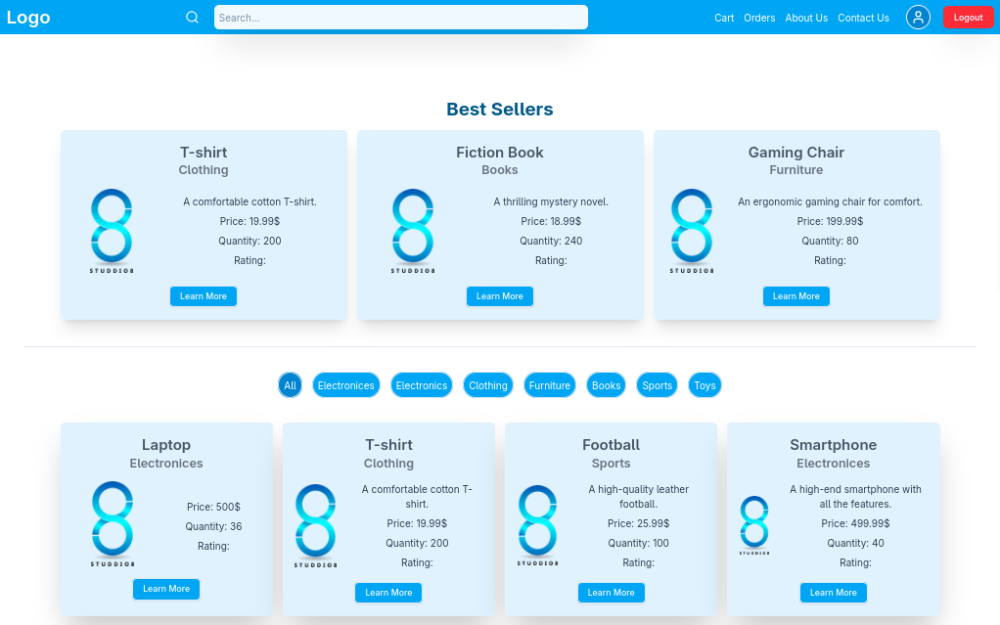
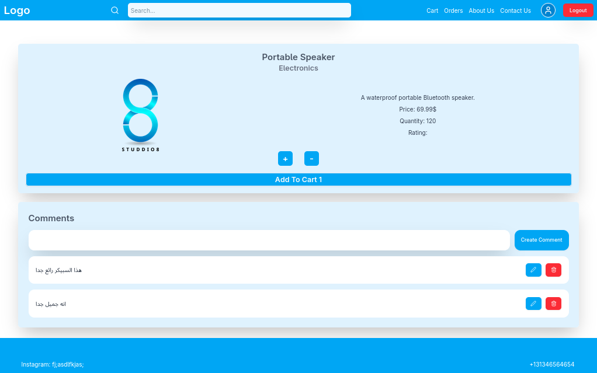

# 🛍️ متجر إلكتروني - الواجهة الأمامية (Frontend)

الواجهة الأمامية مبنية باستخدام [Next.js](https://nextjs.org/) وتتصل بـ API مبني بـ NestJS.  
توفر تجربة مستخدم سلسة لعرض المنتجات، تسجيل الدخول، إدارة السلة، والطلبات.

---

## 🚀 المتطلبات

- Node.js >= 18
- pnpm أو npm أو yarn
- اتصال بخادم الـ Backend

---

## 📦 التثبيت

```bash

pnpm install
# أو
npm install
# أو
yarn install
``` 
⚙️ الإعداد
أنشئ ملف .env في جذر المشروع:
- NEXT_PUBLIC_API_URL=http://localhost:3000

---

▶️ التشغيل
```
npm run dev
yarn run dev
pnpm run dev
```
---

🛠️ البناء للإنتاج
```
pnpm run build
pnpm run start
```
---

🧱 بنية المشروع

``` 
src/
├── pages/               ← الصفحاتتفاصيل المنتج
├── components/          ← مكونات الواجهة
│   ├── Navbar.tsx
│   ├── Footer.tsx
│   └── ...
├── modules/             ← منطق السلة، الطلبات، المنتجات...
├── lib/                 ← دوال مساعدة
```
---

💡 الميزات
- تسجيل الدخول والتسجيل باستخدام JWT
- عرض المنتجات والتصنيفات
- فلترة المنتجات حسب التصنيف
- سلة شراء ديناميكية
- سلة شراء ديناميكية
- تقييم المنتجات
- تجربة مستخدم محسّنة مع رسائل تنبيه (Toasts)
- تحميل كسول (Lazy loading) للصور والمكونات
---

🧠 التقنيات المستخدمة
- NextJs
- ReactJs
- TailwindCss
- Redux
---

🖼️ صور من التطبيق

---

---


👨‍💻 المطور


تم تطوير هذه الواجهة كجزء من مشروع متجر إلكتروني كامل.
امن ضمن الفترى التعليم.

GitHub: @username
